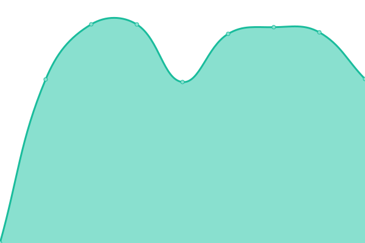
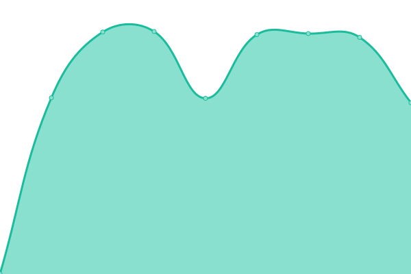
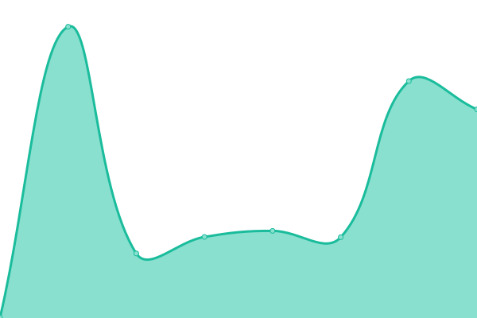
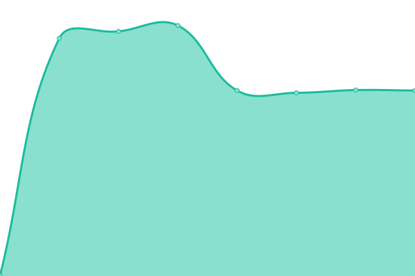
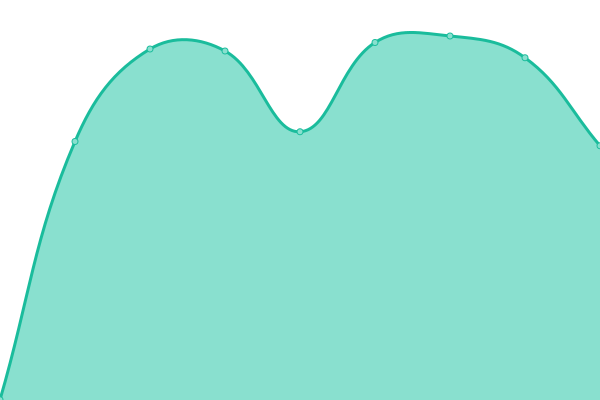
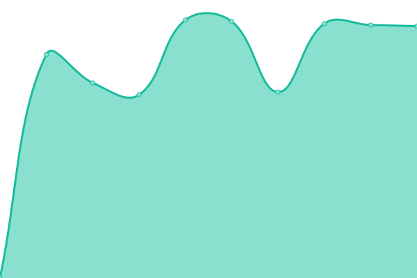
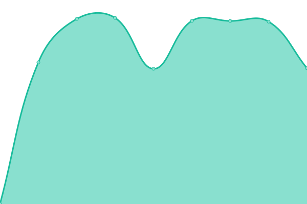
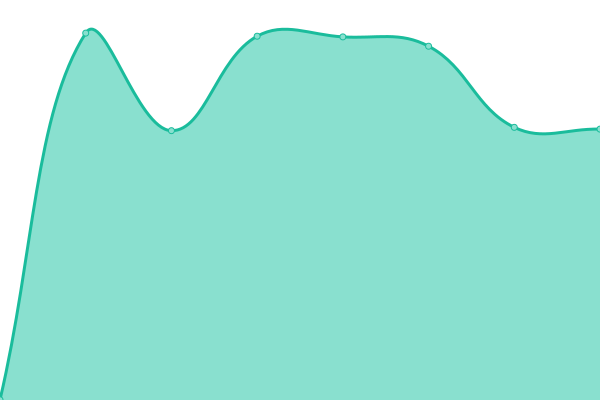

# [📈 Live Status](https://cuongnd-scs.github.io/uptime/): <!--live status--> **🟩 All systems operational**

<!--start: status pages-->
<!-- This summary is generated by Upptime (https://github.com/upptime/upptime) -->
<!-- Do not edit this manually, your changes will be overwritten -->
<!-- prettier-ignore -->
| URL | Status | History | Response Time | Uptime |
| --- | ------ | ------- | ------------- | ------ |
|  [web2](www.gear71.com) | 🟩 Up | [web2.yml](https://github.com/cuongnd-scs/uptime/commits/HEAD/history/web2.yml) | 

 1423ms
     
 | 

<a href="https://cuongnd-scs.github.io/uptime/history/web2">100.00%</a>
    

|  [web3](gear71.com) | 🟩 Up | [web3.yml](https://github.com/cuongnd-scs/uptime/commits/HEAD/history/web3.yml) | 

 768ms
     
 | 

<a href="https://cuongnd-scs.github.io/uptime/history/web3">100.00%</a>
    

|  [web4](captain-portal-nightly.scs71.com) | 🟩 Up | [web4.yml](https://github.com/cuongnd-scs/uptime/commits/HEAD/history/web4.yml) | 

 1226ms
     
 | 

<a href="https://cuongnd-scs.github.io/uptime/history/web4">100.00%</a>
    

|  [web5](vqs-one-nightly.scs71.com) | 🟩 Up | [web5.yml](https://github.com/cuongnd-scs/uptime/commits/HEAD/history/web5.yml) | 

 1219ms
     
 | 

<a href="https://cuongnd-scs.github.io/uptime/history/web5">100.00%</a>
    

|  [web6](captain-portal-staging.scs71.com) | 🟩 Up | [web6.yml](https://github.com/cuongnd-scs/uptime/commits/HEAD/history/web6.yml) | 

 1212ms
     
 | 

<a href="https://cuongnd-scs.github.io/uptime/history/web6">100.00%</a>
    

|  [web7](dock-scheduler-staging.scs71.com) | 🟩 Up | [web7.yml](https://github.com/cuongnd-scs/uptime/commits/HEAD/history/web7.yml) | 

 1198ms
     
 | 

<a href="https://cuongnd-scs.github.io/uptime/history/web7">100.00%</a>
    

|  [web8](vits-staging.scs71.com) | 🟩 Up | [web8.yml](https://github.com/cuongnd-scs/uptime/commits/HEAD/history/web8.yml) | 

 1199ms
     
 | 

<a href="https://cuongnd-scs.github.io/uptime/history/web8">100.00%</a>
    

|  [web9](vqs-one-staging.scs71.com) | 🟩 Up | [web9.yml](https://github.com/cuongnd-scs/uptime/commits/HEAD/history/web9.yml) | 

 1200ms
     
 | 

<a href="https://cuongnd-scs.github.io/uptime/history/web9">100.00%</a>
    

|  [web10](dock-scheduler-nightly.scs71.com) | 🟩 Up | [web10.yml](https://github.com/cuongnd-scs/uptime/commits/HEAD/history/web10.yml) | 

 1205ms
     
 | 

<a href="https://cuongnd-scs.github.io/uptime/history/web10">100.00%</a>
    

|  [web11](captain-portal.scs71.com) | 🟩 Up | [web11.yml](https://github.com/cuongnd-scs/uptime/commits/HEAD/history/web11.yml) | 

 460ms
     
 | 

<a href="https://cuongnd-scs.github.io/uptime/history/web11">100.00%</a>
    

|  [web12](ooo.scs71.com) | 🟩 Up | [web12.yml](https://github.com/cuongnd-scs/uptime/commits/HEAD/history/web12.yml) | 

 176ms
     
 | 

<a href="https://cuongnd-scs.github.io/uptime/history/web12">100.00%</a>
    

|  [web13](www.scs71.com) | 🟩 Up | [web13.yml](https://github.com/cuongnd-scs/uptime/commits/HEAD/history/web13.yml) | 

 989ms
     
 | 

<a href="https://cuongnd-scs.github.io/uptime/history/web13">100.00%</a>
    

|  [web14](scs71.com) | 🟩 Up | [web14.yml](https://github.com/cuongnd-scs/uptime/commits/HEAD/history/web14.yml) | 

 548ms
     
 | 

<a href="https://cuongnd-scs.github.io/uptime/history/web14">100.00%</a>
    

|  [web17](dock-scheduler.scs71.com) | 🟩 Up | [web17.yml](https://github.com/cuongnd-scs/uptime/commits/HEAD/history/web17.yml) | 

 448ms
     
 | 

<a href="https://cuongnd-scs.github.io/uptime/history/web17">100.00%</a>
    

|  [web18](flamingo.scs71.com) | 🟩 Up | [web18.yml](https://github.com/cuongnd-scs/uptime/commits/HEAD/history/web18.yml) | 

 462ms
     
 | 

<a href="https://cuongnd-scs.github.io/uptime/history/web18">100.00%</a>
    

|  [web19](g.scs71.com) | 🟩 Up | [web19.yml](https://github.com/cuongnd-scs/uptime/commits/HEAD/history/web19.yml) | 

 671ms
     
 | 

<a href="https://cuongnd-scs.github.io/uptime/history/web19">100.00%</a>
    

|  [web20](snipe-one.scs71.com) | 🟩 Up | [web20.yml](https://github.com/cuongnd-scs/uptime/commits/HEAD/history/web20.yml) | 

 1438ms
     
 | 

<a href="https://cuongnd-scs.github.io/uptime/history/web20">100.00%</a>
    

|  [web21](vqs-one.scs71.com) | 🟩 Up | [web21.yml](https://github.com/cuongnd-scs/uptime/commits/HEAD/history/web21.yml) | 

 466ms
     
 | 

<a href="https://cuongnd-scs.github.io/uptime/history/web21">100.00%</a>
    

|  [web22](cargoschedule.com) | 🟩 Up | [web22.yml](https://github.com/cuongnd-scs/uptime/commits/HEAD/history/web22.yml) | 

 1212ms
     
 | 

<a href="https://cuongnd-scs.github.io/uptime/history/web22">100.00%</a>
    

|  [web23](demo-crawler.cargoschedule.com) | 🟩 Up | [web23.yml](https://github.com/cuongnd-scs/uptime/commits/HEAD/history/web23.yml) | 

 1418ms
     
 | 

<a href="https://cuongnd-scs.github.io/uptime/history/web23">100.00%</a>
    

|  [web24](demo-csm.cargoschedule.com) | 🟩 Up | [web24.yml](https://github.com/cuongnd-scs/uptime/commits/HEAD/history/web24.yml) | 

 1239ms
     
 | 

<a href="https://cuongnd-scs.github.io/uptime/history/web24">100.00%</a>
    

|  [web25](demo.cargoschedule.com) | 🟩 Up | [web25.yml](https://github.com/cuongnd-scs/uptime/commits/HEAD/history/web25.yml) | 

 1194ms
     
 | 

<a href="https://cuongnd-scs.github.io/uptime/history/web25">100.00%</a>
    

|  [web26](nightly-com.cargoschedule.com) | 🟩 Up | [web26.yml](https://github.com/cuongnd-scs/uptime/commits/HEAD/history/web26.yml) | 

 1201ms
     
 | 

<a href="https://cuongnd-scs.github.io/uptime/history/web26">100.00%</a>
    

|  [web27](nightly-crawler.cargoschedule.com) | 🟩 Up | [web27.yml](https://github.com/cuongnd-scs/uptime/commits/HEAD/history/web27.yml) | 

 1405ms
     
 | 

<a href="https://cuongnd-scs.github.io/uptime/history/web27">100.00%</a>
    

|  [web28](nightly.cargoschedule.com) | 🟩 Up | [web28.yml](https://github.com/cuongnd-scs/uptime/commits/HEAD/history/web28.yml) | 

 1226ms
     
 | 

<a href="https://cuongnd-scs.github.io/uptime/history/web28">100.00%</a>
    

|  [web31](staging.cargoschedule.com) | 🟩 Up | [web31.yml](https://github.com/cuongnd-scs/uptime/commits/HEAD/history/web31.yml) | 

 1211ms
     
 | 

<a href="https://cuongnd-scs.github.io/uptime/history/web31">100.00%</a>
    

|  [web32](dock-scheduler.scs71.com) | 🟩 Up | [web32.yml](https://github.com/cuongnd-scs/uptime/commits/HEAD/history/web32.yml) | 

 380ms
     
 | 

<a href="https://cuongnd-scs.github.io/uptime/history/web32">100.00%</a>
    

|  [web36](error.symcresol.com) | 🟩 Up | [web36.yml](https://github.com/cuongnd-scs/uptime/commits/HEAD/history/web36.yml) | 

 1738ms
     
 | 

<a href="https://cuongnd-scs.github.io/uptime/history/web36">100.00%</a>
    

|  [web37](flamingo-nightly.symcresol.com) | 🟩 Up | [web37.yml](https://github.com/cuongnd-scs/uptime/commits/HEAD/history/web37.yml) | 

 1204ms
     
 | 

<a href="https://cuongnd-scs.github.io/uptime/history/web37">100.00%</a>
    

|  [web38](flamingo-nyk-sg.symcresol.com) | 🟩 Up | [web38.yml](https://github.com/cuongnd-scs/uptime/commits/HEAD/history/web38.yml) | 

 1204ms
     
 | 

<a href="https://cuongnd-scs.github.io/uptime/history/web38">100.00%</a>
    

|  [web39](flamingo-sg.symcresol.com) | 🟩 Up | [web39.yml](https://github.com/cuongnd-scs/uptime/commits/HEAD/history/web39.yml) | 

 1212ms
     
 | 

<a href="https://cuongnd-scs.github.io/uptime/history/web39">100.00%</a>
    

|  [web40](g.symcresol.com) | 🟩 Up | [web40.yml](https://github.com/cuongnd-scs/uptime/commits/HEAD/history/web40.yml) | 

 1404ms
     
 | 

<a href="https://cuongnd-scs.github.io/uptime/history/web40">100.00%</a>
    

|  [web41](gear-staging.symcresol.com) | 🟩 Up | [web41.yml](https://github.com/cuongnd-scs/uptime/commits/HEAD/history/web41.yml) | 

 1395ms
     
 | 

<a href="https://cuongnd-scs.github.io/uptime/history/web41">100.00%</a>
    

|  [web42](gearnightly.symcresol.com) | 🟩 Up | [web42.yml](https://github.com/cuongnd-scs/uptime/commits/HEAD/history/web42.yml) | 

 1486ms
     
 | 

<a href="https://cuongnd-scs.github.io/uptime/history/web42">100.00%</a>
    

|  [web43](geartestingsg.symcresol.com) | 🟩 Up | [web43.yml](https://github.com/cuongnd-scs/uptime/commits/HEAD/history/web43.yml) | 

 458ms
     
 | 

<a href="https://cuongnd-scs.github.io/uptime/history/web43">100.00%</a>
    

|  [web44](grafana.symcresol.com) | 🟩 Up | [web44.yml](https://github.com/cuongnd-scs/uptime/commits/HEAD/history/web44.yml) | 

 1564ms
     
 | 

<a href="https://cuongnd-scs.github.io/uptime/history/web44">100.00%</a>
    

|  [web46](homepage-nightly.symcresol.com) | 🟩 Up | [web46.yml](https://github.com/cuongnd-scs/uptime/commits/HEAD/history/web46.yml) | 

 943ms
     
 | 

<a href="https://cuongnd-scs.github.io/uptime/history/web46">100.00%</a>
    

|  [web47](redash.symcresol.com) | 🟩 Up | [web47.yml](https://github.com/cuongnd-scs/uptime/commits/HEAD/history/web47.yml) | 

 1496ms
     
 | 

<a href="https://cuongnd-scs.github.io/uptime/history/web47">100.00%</a>
    

|  [web48](snipe-nightly.symcresol.com) | 🟩 Up | [web48.yml](https://github.com/cuongnd-scs/uptime/commits/HEAD/history/web48.yml) | 

 1189ms
     
 | 

<a href="https://cuongnd-scs.github.io/uptime/history/web48">100.00%</a>
    

|  [web49](snipe-sg.symcresol.com) | 🟩 Up | [web49.yml](https://github.com/cuongnd-scs/uptime/commits/HEAD/history/web49.yml) | 

 1230ms
     
 | 

<a href="https://cuongnd-scs.github.io/uptime/history/web49">100.00%</a>
    

|  [web51](vits-nightly-be.symcresol.com) | 🟩 Up | [web51.yml](https://github.com/cuongnd-scs/uptime/commits/HEAD/history/web51.yml) | 

 1192ms
     
 | 

<a href="https://cuongnd-scs.github.io/uptime/history/web51">100.00%</a>
    

|  [web52](vits-nightly-ecs.symcresol.com) | 🟩 Up | [web52.yml](https://github.com/cuongnd-scs/uptime/commits/HEAD/history/web52.yml) | 

 1183ms
     
 | 

<a href="https://cuongnd-scs.github.io/uptime/history/web52">100.00%</a>
    

|  [web53](vits-nightly.symcresol.com) | 🟩 Up | [web53.yml](https://github.com/cuongnd-scs/uptime/commits/HEAD/history/web53.yml) | 

 1186ms
     
 | 

<a href="https://cuongnd-scs.github.io/uptime/history/web53">100.00%</a>
    

|  [web54](https://scs71.com) | 🟩 Up | [web54.yml](https://github.com/cuongnd-scs/uptime/commits/HEAD/history/web54.yml) | 

 800ms
     
 | 

<a href="https://cuongnd-scs.github.io/uptime/history/web54">100.00%</a>
    

<!--end: status pages-->

[**Visit our status website →**](https://cuongnd-scs.github.io/uptime/)

## 📄 License

- Powered by: [Upptime](https://github.com/upptime/upptime)
- Code: [MIT](./LICENSE) © [Upptime](https://upptime.js.org)
- Data in the `./history` directory: [Open Database License](https://opendatacommons.org/licenses/odbl/1-0/)
