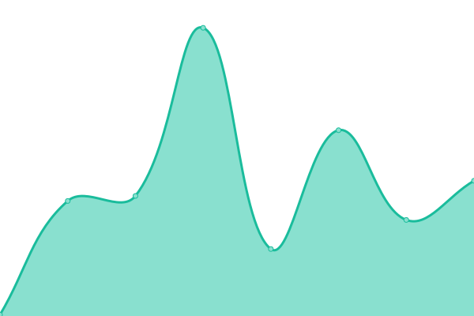
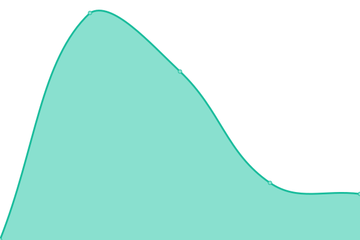

# [📈 Live Status](https://cuong-nd.github.io/uptime/): <!--live status--> **🟩 All systems operational**

<!--start: status pages-->
<!-- This summary is generated by Upptime (https://github.com/upptime/upptime) -->
<!-- Do not edit this manually, your changes will be overwritten -->
<!-- prettier-ignore -->
| URL | Status | History | Response Time | Uptime |
| --- | ------ | ------- | ------------- | ------ |
|  [scs71.com](https://scs71.com) | 🟩 Up | [scs71-com.yml](https://github.com/cuong-nd/uptime/commits/HEAD/history/scs71-com.yml) | 

 99ms
     
 | 

<a href="https://cuong-nd.github.io/uptime/history/scs71-com">100.00%</a>
    

|  [cuong-dev.ml](http://cuong-dev.ml) | 🟩 Up | [cuong-dev-ml.yml](https://github.com/cuong-nd/uptime/commits/HEAD/history/cuong-dev-ml.yml) | 

 4984ms
     
 | 

<a href="https://cuong-nd.github.io/uptime/history/cuong-dev-ml">96.73%</a>
    

|  [docs.cuong-dev.ml](http://docs.cuong-dev.ml) | 🟩 Up | [docs-cuong-dev-ml.yml](https://github.com/cuong-nd/uptime/commits/HEAD/history/docs-cuong-dev-ml.yml) | 

 5567ms
     
 | 

<a href="https://cuong-nd.github.io/uptime/history/docs-cuong-dev-ml">96.63%</a>
    

<!--end: status pages-->

[**Visit our status website →**](https://cuong-nd.github.io/uptime/)

## 📄 License

- Powered by: [Upptime](https://github.com/upptime/upptime)
- Code: [MIT](./LICENSE) © [Upptime](https://upptime.js.org)
- Data in the `./history` directory: [Open Database License](https://opendatacommons.org/licenses/odbl/1-0/)
