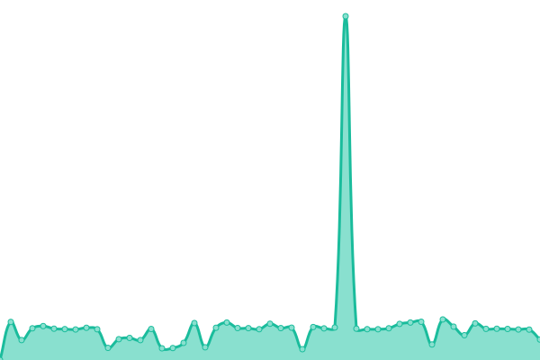

# [📈 Live Status](https://cuongnd-scs.github.io/uptime/): <!--live status--> **🟥 Complete outage**

<!--start: status pages-->
<!-- This summary is generated by Upptime (https://github.com/upptime/upptime) -->
<!-- Do not edit this manually, your changes will be overwritten -->
<!-- prettier-ignore -->
| URL | Status | History | Response Time | Uptime |
| --- | ------ | ------- | ------------- | ------ |
|  [web](guardian-data.symcresol.com) | 🟥 Down | [web.yml](https://github.com/cuongnd-scs/uptime/commits/HEAD/history/web.yml) | 

 1356ms
     
 | 

<a href="https://cuongnd-scs.github.io/uptime/history/web">43.36%</a>
    

|  [web](www.gear71.com) | 🟥 Down | [web.yml](https://github.com/cuongnd-scs/uptime/commits/HEAD/history/web.yml) | 

 1356ms
     
 | 

<a href="https://cuongnd-scs.github.io/uptime/history/web">43.33%</a>
    

|  [web](gear71.com) | 🟥 Down | [web.yml](https://github.com/cuongnd-scs/uptime/commits/HEAD/history/web.yml) | 

 1356ms
     
 | 

<a href="https://cuongnd-scs.github.io/uptime/history/web">43.29%</a>
    

|  [web](captain-portal-nightly.scs71.com) | 🟥 Down | [web.yml](https://github.com/cuongnd-scs/uptime/commits/HEAD/history/web.yml) | 

 1356ms
     
 | 

<a href="https://cuongnd-scs.github.io/uptime/history/web">43.31%</a>
    

|  [web](vqs-one-nightly.scs71.com) | 🟥 Down | [web.yml](https://github.com/cuongnd-scs/uptime/commits/HEAD/history/web.yml) | 

 1356ms
     
 | 

<a href="https://cuongnd-scs.github.io/uptime/history/web">43.27%</a>
    

|  [web](captain-portal-staging.scs71.com) | 🟥 Down | [web.yml](https://github.com/cuongnd-scs/uptime/commits/HEAD/history/web.yml) | 

 1356ms
     
 | 

<a href="https://cuongnd-scs.github.io/uptime/history/web">43.29%</a>
    

|  [web](dock-scheduler-staging.scs71.com) | 🟥 Down | [web.yml](https://github.com/cuongnd-scs/uptime/commits/HEAD/history/web.yml) | 

 1356ms
     
 | 

<a href="https://cuongnd-scs.github.io/uptime/history/web">43.25%</a>
    

|  [web](vits-staging.scs71.com) | 🟥 Down | [web.yml](https://github.com/cuongnd-scs/uptime/commits/HEAD/history/web.yml) | 

 1356ms
     
 | 

<a href="https://cuongnd-scs.github.io/uptime/history/web">43.27%</a>
    

|  [web](vqs-one-staging.scs71.com) | 🟥 Down | [web.yml](https://github.com/cuongnd-scs/uptime/commits/HEAD/history/web.yml) | 

 1356ms
     
 | 

<a href="https://cuongnd-scs.github.io/uptime/history/web">43.22%</a>
    

|  [web](dock-scheduler-nightly.scs71.com) | 🟥 Down | [web.yml](https://github.com/cuongnd-scs/uptime/commits/HEAD/history/web.yml) | 

 1356ms
     
 | 

<a href="https://cuongnd-scs.github.io/uptime/history/web">43.24%</a>
    

|  [web](captain-portal.scs71.com) | 🟥 Down | [web.yml](https://github.com/cuongnd-scs/uptime/commits/HEAD/history/web.yml) | 

 1356ms
     
 | 

<a href="https://cuongnd-scs.github.io/uptime/history/web">43.20%</a>
    

|  [web](ooo.scs71.com) | 🟥 Down | [web.yml](https://github.com/cuongnd-scs/uptime/commits/HEAD/history/web.yml) | 

 1356ms
     
 | 

<a href="https://cuongnd-scs.github.io/uptime/history/web">43.22%</a>
    

|  [web](www.scs71.com) | 🟥 Down | [web.yml](https://github.com/cuongnd-scs/uptime/commits/HEAD/history/web.yml) | 

 1356ms
     
 | 

<a href="https://cuongnd-scs.github.io/uptime/history/web">43.18%</a>
    

|  [web](scs71.com) | 🟥 Down | [web.yml](https://github.com/cuongnd-scs/uptime/commits/HEAD/history/web.yml) | 

 1356ms
     
 | 

<a href="https://cuongnd-scs.github.io/uptime/history/web">43.14%</a>
    

|  [web](bacs-api.scs71.com) | 🟥 Down | [web.yml](https://github.com/cuongnd-scs/uptime/commits/HEAD/history/web.yml) | 

 1356ms
     
 | 

<a href="https://cuongnd-scs.github.io/uptime/history/web">43.16%</a>
    

|  [web](email.scs71.com) | 🟥 Down | [web.yml](https://github.com/cuongnd-scs/uptime/commits/HEAD/history/web.yml) | 

 1356ms
     
 | 

<a href="https://cuongnd-scs.github.io/uptime/history/web">43.12%</a>
    

|  [web](dock-scheduler.scs71.com) | 🟥 Down | [web.yml](https://github.com/cuongnd-scs/uptime/commits/HEAD/history/web.yml) | 

 1356ms
     
 | 

<a href="https://cuongnd-scs.github.io/uptime/history/web">43.13%</a>
    

|  [web](flamingo.scs71.com) | 🟥 Down | [web.yml](https://github.com/cuongnd-scs/uptime/commits/HEAD/history/web.yml) | 

 1356ms
     
 | 

<a href="https://cuongnd-scs.github.io/uptime/history/web">43.09%</a>
    

|  [web](g.scs71.com) | 🟥 Down | [web.yml](https://github.com/cuongnd-scs/uptime/commits/HEAD/history/web.yml) | 

 1356ms
     
 | 

<a href="https://cuongnd-scs.github.io/uptime/history/web">43.11%</a>
    

|  [web](snipe-one.scs71.com) | 🟥 Down | [web.yml](https://github.com/cuongnd-scs/uptime/commits/HEAD/history/web.yml) | 

 1356ms
     
 | 

<a href="https://cuongnd-scs.github.io/uptime/history/web">43.07%</a>
    

|  [web](vqs-one.scs71.com) | 🟥 Down | [web.yml](https://github.com/cuongnd-scs/uptime/commits/HEAD/history/web.yml) | 

 1356ms
     
 | 

<a href="https://cuongnd-scs.github.io/uptime/history/web">43.09%</a>
    

|  [web](cargoschedule.com) | 🟥 Down | [web.yml](https://github.com/cuongnd-scs/uptime/commits/HEAD/history/web.yml) | 

 1356ms
     
 | 

<a href="https://cuongnd-scs.github.io/uptime/history/web">43.05%</a>
    

|  [web](demo-crawler.cargoschedule.com) | 🟥 Down | [web.yml](https://github.com/cuongnd-scs/uptime/commits/HEAD/history/web.yml) | 

 1356ms
     
 | 

<a href="https://cuongnd-scs.github.io/uptime/history/web">43.06%</a>
    

|  [web](demo-csm.cargoschedule.com) | 🟥 Down | [web.yml](https://github.com/cuongnd-scs/uptime/commits/HEAD/history/web.yml) | 

 1356ms
     
 | 

<a href="https://cuongnd-scs.github.io/uptime/history/web">43.02%</a>
    

|  [web](demo.cargoschedule.com) | 🟥 Down | [web.yml](https://github.com/cuongnd-scs/uptime/commits/HEAD/history/web.yml) | 

 1356ms
     
 | 

<a href="https://cuongnd-scs.github.io/uptime/history/web">43.04%</a>
    

|  [web](nightly-com.cargoschedule.com) | 🟥 Down | [web.yml](https://github.com/cuongnd-scs/uptime/commits/HEAD/history/web.yml) | 

 1356ms
     
 | 

<a href="https://cuongnd-scs.github.io/uptime/history/web">43.00%</a>
    

|  [web](nightly-crawler.cargoschedule.com) | 🟥 Down | [web.yml](https://github.com/cuongnd-scs/uptime/commits/HEAD/history/web.yml) | 

 1356ms
     
 | 

<a href="https://cuongnd-scs.github.io/uptime/history/web">43.02%</a>
    

|  [web](nightly.cargoschedule.com) | 🟥 Down | [web.yml](https://github.com/cuongnd-scs/uptime/commits/HEAD/history/web.yml) | 

 1356ms
     
 | 

<a href="https://cuongnd-scs.github.io/uptime/history/web">42.98%</a>
    

|  [web](staging-com.cargoschedule.com) | 🟥 Down | [web.yml](https://github.com/cuongnd-scs/uptime/commits/HEAD/history/web.yml) | 

 1356ms
     
 | 

<a href="https://cuongnd-scs.github.io/uptime/history/web">42.99%</a>
    

|  [web](staging-crawler.cargoschedule.com) | 🟥 Down | [web.yml](https://github.com/cuongnd-scs/uptime/commits/HEAD/history/web.yml) | 

 1356ms
     
 | 

<a href="https://cuongnd-scs.github.io/uptime/history/web">42.95%</a>
    

|  [web](staging.cargoschedule.com) | 🟥 Down | [web.yml](https://github.com/cuongnd-scs/uptime/commits/HEAD/history/web.yml) | 

 1356ms
     
 | 

<a href="https://cuongnd-scs.github.io/uptime/history/web">42.97%</a>
    

|  [web](dock-scheduler.scs71.com) | 🟥 Down | [web.yml](https://github.com/cuongnd-scs/uptime/commits/HEAD/history/web.yml) | 

 1356ms
     
 | 

<a href="https://cuongnd-scs.github.io/uptime/history/web">42.93%</a>
    

|  [web](api-flamingo-sg.symcresol.com) | 🟥 Down | [web.yml](https://github.com/cuongnd-scs/uptime/commits/HEAD/history/web.yml) | 

 1356ms
     
 | 

<a href="https://cuongnd-scs.github.io/uptime/history/web">42.89%</a>
    

|  [web](bacs-api-nightly.symcresol.com) | 🟥 Down | [web.yml](https://github.com/cuongnd-scs/uptime/commits/HEAD/history/web.yml) | 

 1356ms
     
 | 

<a href="https://cuongnd-scs.github.io/uptime/history/web">42.91%</a>
    

|  [web](bacs-api-sg.symcresol.com) | 🟥 Down | [web.yml](https://github.com/cuongnd-scs/uptime/commits/HEAD/history/web.yml) | 

 1356ms
     
 | 

<a href="https://cuongnd-scs.github.io/uptime/history/web">42.87%</a>
    

|  [web](chatbot-crawler-sg.symcresol.com) | 🟥 Down | [web.yml](https://github.com/cuongnd-scs/uptime/commits/HEAD/history/web.yml) | 

 1356ms
     
 | 

<a href="https://cuongnd-scs.github.io/uptime/history/web">42.89%</a>
    

|  [web](chatbot-crawler.symcresol.com) | 🟥 Down | [web.yml](https://github.com/cuongnd-scs/uptime/commits/HEAD/history/web.yml) | 

 1356ms
     
 | 

<a href="https://cuongnd-scs.github.io/uptime/history/web">42.85%</a>
    

|  [web](error.symcresol.com) | 🟥 Down | [web.yml](https://github.com/cuongnd-scs/uptime/commits/HEAD/history/web.yml) | 

 1356ms
     
 | 

<a href="https://cuongnd-scs.github.io/uptime/history/web">42.87%</a>
    

|  [web](flamingo-nightly.symcresol.com) | 🟥 Down | [web.yml](https://github.com/cuongnd-scs/uptime/commits/HEAD/history/web.yml) | 

 1356ms
     
 | 

<a href="https://cuongnd-scs.github.io/uptime/history/web">42.83%</a>
    

|  [web](flamingo-nyk-sg.symcresol.com) | 🟥 Down | [web.yml](https://github.com/cuongnd-scs/uptime/commits/HEAD/history/web.yml) | 

 1356ms
     
 | 

<a href="https://cuongnd-scs.github.io/uptime/history/web">42.85%</a>
    

|  [web](flamingo-sg.symcresol.com) | 🟥 Down | [web.yml](https://github.com/cuongnd-scs/uptime/commits/HEAD/history/web.yml) | 

 1356ms
     
 | 

<a href="https://cuongnd-scs.github.io/uptime/history/web">42.80%</a>
    

|  [web](g.symcresol.com) | 🟥 Down | [web.yml](https://github.com/cuongnd-scs/uptime/commits/HEAD/history/web.yml) | 

 1356ms
     
 | 

<a href="https://cuongnd-scs.github.io/uptime/history/web">42.77%</a>
    

|  [web](gear-staging.symcresol.com) | 🟥 Down | [web.yml](https://github.com/cuongnd-scs/uptime/commits/HEAD/history/web.yml) | 

 1356ms
     
 | 

<a href="https://cuongnd-scs.github.io/uptime/history/web">42.78%</a>
    

|  [web](gearnightly.symcresol.com) | 🟥 Down | [web.yml](https://github.com/cuongnd-scs/uptime/commits/HEAD/history/web.yml) | 

 1356ms
     
 | 

<a href="https://cuongnd-scs.github.io/uptime/history/web">42.80%</a>
    

|  [web](geartestingsg.symcresol.com) | 🟥 Down | [web.yml](https://github.com/cuongnd-scs/uptime/commits/HEAD/history/web.yml) | 

 1356ms
     
 | 

<a href="https://cuongnd-scs.github.io/uptime/history/web">42.76%</a>
    

|  [web](grafana.symcresol.com) | 🟥 Down | [web.yml](https://github.com/cuongnd-scs/uptime/commits/HEAD/history/web.yml) | 

 1356ms
     
 | 

<a href="https://cuongnd-scs.github.io/uptime/history/web">42.72%</a>
    

|  [web](guardian-data.symcresol.com) | 🟥 Down | [web.yml](https://github.com/cuongnd-scs/uptime/commits/HEAD/history/web.yml) | 

 1356ms
     
 | 

<a href="https://cuongnd-scs.github.io/uptime/history/web">42.74%</a>
    

|  [web](guardian-production.symcresol.com) | 🟥 Down | [web.yml](https://github.com/cuongnd-scs/uptime/commits/HEAD/history/web.yml) | 

 1356ms
     
 | 

<a href="https://cuongnd-scs.github.io/uptime/history/web">42.70%</a>
    

|  [web](homepage-nightly.symcresol.com) | 🟥 Down | [web.yml](https://github.com/cuongnd-scs/uptime/commits/HEAD/history/web.yml) | 

 1356ms
     
 | 

<a href="https://cuongnd-scs.github.io/uptime/history/web">42.72%</a>
    

|  [web](redash.symcresol.com) | 🟥 Down | [web.yml](https://github.com/cuongnd-scs/uptime/commits/HEAD/history/web.yml) | 

 1356ms
     
 | 

<a href="https://cuongnd-scs.github.io/uptime/history/web">42.68%</a>
    

|  [web](snipe-nightly.symcresol.com) | 🟥 Down | [web.yml](https://github.com/cuongnd-scs/uptime/commits/HEAD/history/web.yml) | 

 1356ms
     
 | 

<a href="https://cuongnd-scs.github.io/uptime/history/web">42.70%</a>
    

|  [web](snipe-sg.symcresol.com) | 🟥 Down | [web.yml](https://github.com/cuongnd-scs/uptime/commits/HEAD/history/web.yml) | 

 1356ms
     
 | 

<a href="https://cuongnd-scs.github.io/uptime/history/web">42.66%</a>
    

|  [web](vits-backend-staging.symcresol.com) | 🟥 Down | [web.yml](https://github.com/cuongnd-scs/uptime/commits/HEAD/history/web.yml) | 

 1356ms
     
 | 

<a href="https://cuongnd-scs.github.io/uptime/history/web">42.67%</a>
    

|  [web](vits-nightly-be.symcresol.com) | 🟥 Down | [web.yml](https://github.com/cuongnd-scs/uptime/commits/HEAD/history/web.yml) | 

 1356ms
     
 | 

<a href="https://cuongnd-scs.github.io/uptime/history/web">42.63%</a>
    

|  [web](vits-nightly-ecs.symcresol.com) | 🟥 Down | [web.yml](https://github.com/cuongnd-scs/uptime/commits/HEAD/history/web.yml) | 

 1356ms
     
 | 

<a href="https://cuongnd-scs.github.io/uptime/history/web">42.65%</a>
    

|  [web](vits-nightly.symcresol.com) | 🟥 Down | [web.yml](https://github.com/cuongnd-scs/uptime/commits/HEAD/history/web.yml) | 

 1356ms
     
 | 

<a href="https://cuongnd-scs.github.io/uptime/history/web">42.60%</a>
    

|  [web](https://scs71.com) | 🟥 Down | [web.yml](https://github.com/cuongnd-scs/uptime/commits/HEAD/history/web.yml) | 

 1356ms
     
 | 

<a href="https://cuongnd-scs.github.io/uptime/history/web">42.62%</a>
    

|  [web](https://asdasd.koj.co) | 🟥 Down | [web.yml](https://github.com/cuongnd-scs/uptime/commits/HEAD/history/web.yml) | 

 1356ms
     
 | 

<a href="https://cuongnd-scs.github.io/uptime/history/web">42.58%</a>
    

<!--end: status pages-->

[**Visit our status website →**](https://cuongnd-scs.github.io/uptime/)

## 📄 License

- Powered by: [Upptime](https://github.com/upptime/upptime)
- Code: [MIT](./LICENSE) © [Upptime](https://upptime.js.org)
- Data in the `./history` directory: [Open Database License](https://opendatacommons.org/licenses/odbl/1-0/)
